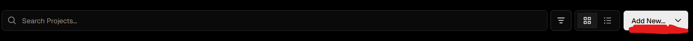
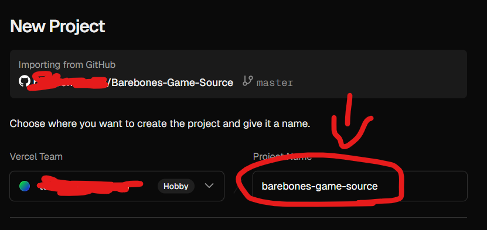
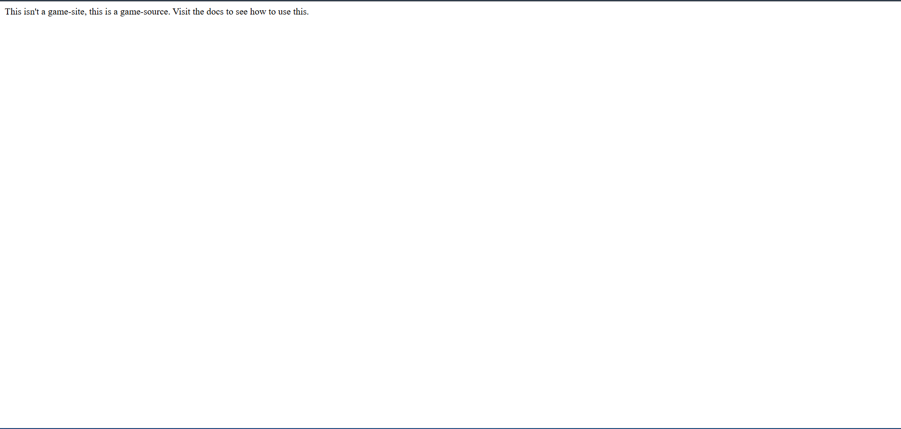

To be able to add games, all you really need to do is just deploy your own copy of the Barebones-UBG game source. From there you can be able to add all the games that are available.
## Preperations
You will need:
- A Github Account
- The Vercel Account from getting started.
## Setting Up The Game Source
1. Make sure your codespace and your vercel account are open.

2. Go [here](https://github.com/barebones-ubg/Barebones-Game-Source) and fork it. Make sure your fork has the same name.
3. Go back to your vercel dashboard and press "Add New" > "Project"

4. Make sure your Github is connected and then click the repo you forked just now.
5. Give your project a unique name such as the name of the site your making + game source.

6. Wait a little bit, and your link should deploy! Now, it will look like this:


Now it is time to actually add the games.

## Add the games to your site.
1. Make sure the codespace from Getting Started is open and the preview is running by making sure you type ``` npx servor ``` into the terminal.

2. Go to the fork of the game-source. From there, in the README, choose a game you want to add. For this guide, I will be using slope plus, but don't do that since its already included in the template from earlier. Keep that idea in your head. Make sure to read what the filename is.

3. Go to https://<"your deployed link">/games/<"filename of the game"> so for example for slope its https://example.com/games/slope.html and copy that
4. Go to your codespace. Open the games.html file. From there, type this out:
 - Make sure the filename is something short you can rememeber, like for slope, "slope.html"
```html
<button onclick="window.location.href='games/(put a file name).html'">(Name of game)</button>
```
5. Go to games folder > Create a file in that folder that is the filename from the last step.
6. In the file, type this out, make sure you
- Replace the text in title with the game name
- replace the game link with your link from step 3.
```html
<!DOCTYPE html>
<html lang="en">
<head>
<title>(Game Name)</title>
<style>
    body {
        margin: 0;
        padding: 0;
        background: #111;
        position: relative;
        min-height: 100vh;
        box-sizing: border-box;
    }
    .game-embed {
        display: block;
        width: 100vw;
        height: calc(100vh - 60px);
        border: none;
        background: #222;
    }
    body {
        background-image: blue;
    }
</style>
</head>
<body>

    <embed id="gameEmbed" class="game-embed" src='game link'></embed>
        <script>
            document.querySelector('.game-embed').focus();
        </script>

</body>
</html>
```
7. Now test. Go to your codespace preview link from earlier, then click on the games button, then, the game you added.
8. Make sure you save your changes by going to the fork icon in the codespace, typing something in the field and pressing "Commit".
## Extra Notes
You now know how to add games. You can keep adding games, and if you've added all of them (somehow), wait for the next batch. I release new batches every Saturday unless there are obfuscations with my schedule.