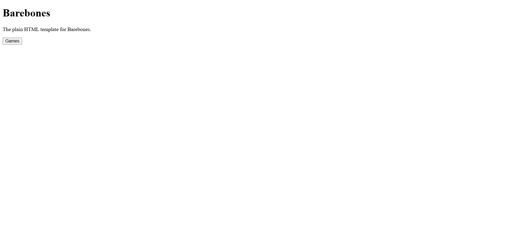

To be able to start working, you need to start with one of the templates. Then you will be able to make your site from the ground up. I will also show you how to add games in the next guide, but this guide only has 1 game just to show how things work.
## Preparations
You will need a:
- Github Account
## Getting the example.
1. Log in to your Github account.

2. Go to [this github repo](https://github.com/barebones-ubg/HTML-Plain) and press the "Fork" button to put it onto your account. Make sure you give it a unique name, as this will be the name of your site unless you rebrand.

    - Please star the repo you are using too please, it gives me alot of motivation and helps alot.
    
3. Go to [the codespaces page](https://github.com/codespaces) and press "New codespace".

4. In the little menu, go to select a repo > The repo you just created. Then click "create".

5. Wait for the thing to load. 

6. Once in the editor, go to the terminal and type ```npm install ``` to install the dependencies needed for it to work.

7. Go ahead and after it is done, type ``` npx servor ```.

8. You will see something pop up, now click "Open in browser".

Doing this correctly will look something like this:



I know, it looks so trash, compared to other sites, but this is because it has zero styling. In another basic guide, we will learn how to style, but for now? You have this.

## Deploying it
Now you will need to actually deploy your site onto a link. For this section, we will use Vercel, but the process is fundementally the same for other providers too. I recommend (once you are done with the guide), to go experiment with different hosting providers, many are better than others.

1. Using your Github account, sign up for Vercel.

2. Click "Add New" > "Project".

3. Make sure your Github is connected and then click the repo you created just now.

4. Give your project a name but hold up. Follow these tips:
    - Make sure your link isn't something obvious like "[YOUR-SITE-NAME]-ubg" or anything like that since you can get your link blocked easily.
    - Try something less "Game-site"-ish. Maybe something like "[YOUR-SITE-NAME]-math" or something like "[YOUR-SITE-NAME]-recipes". Make it something that won't immediately get flagged by an administration software.
5. Once you did that press "Deploy".

6. Now wait a little bit. You then will get a preview of the link. Clicking it will send you to a similar screen as the "Getting the Example" section.

Now you can move onto the next guide.
